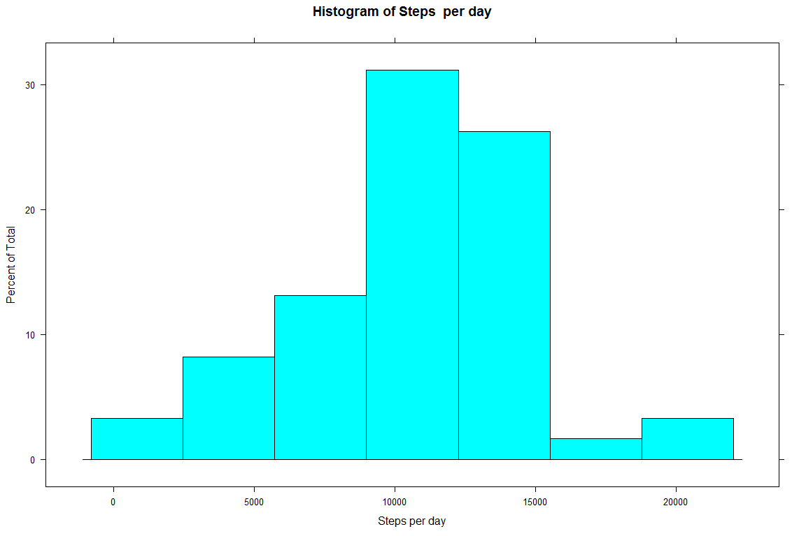
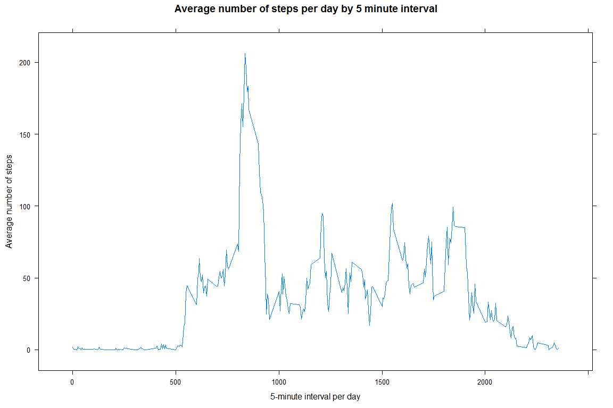
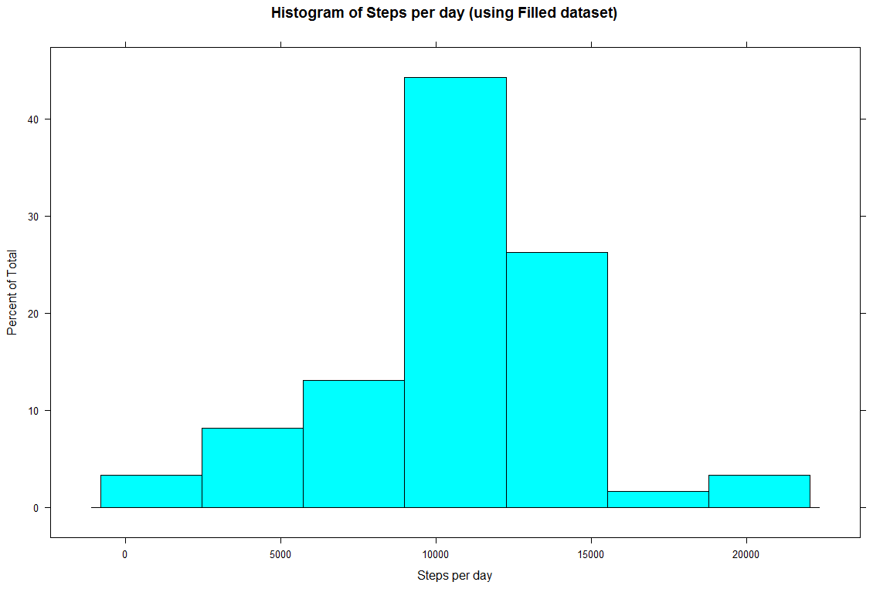
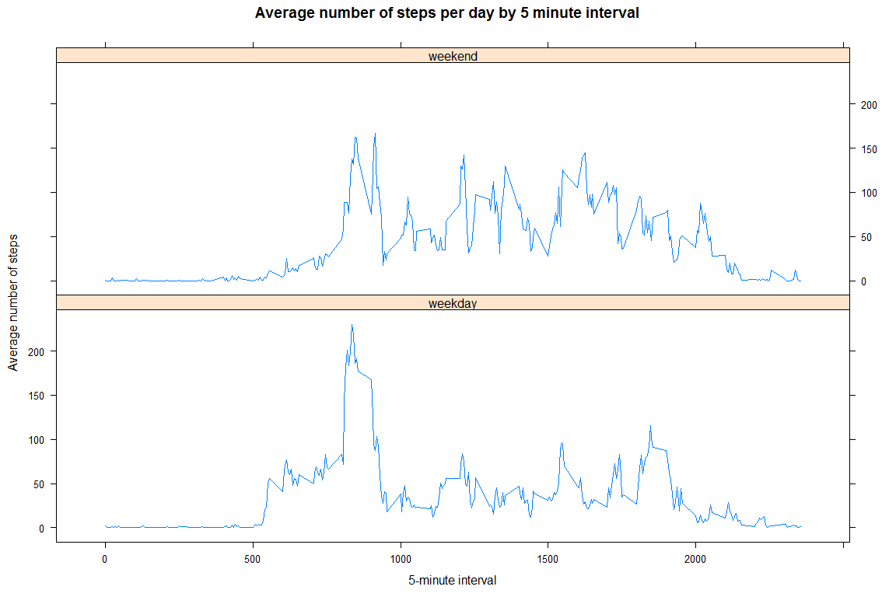

# Reproducible Research: Peer Assessment 1


## Loading and preprocessing the data

```r
library(lattice)

# Configure scientific notation
options("scipen"=100, "digits"=2)

unzip ("activity.zip")
activity <- read.csv("activity.csv",sep=",",header=TRUE,na.strings='NA',stringsAsFactors=FALSE)
activity$date <-as.Date(activity$date, "%Y-%m-%d" )
head(activity)
```

```
##   steps       date interval
## 1    NA 2012-10-01        0
## 2    NA 2012-10-01        5
## 3    NA 2012-10-01       10
## 4    NA 2012-10-01       15
## 5    NA 2012-10-01       20
## 6    NA 2012-10-01       25
```


<br>

******   


## What is mean total number of steps taken per day?

```r
histogram(tapply(activity$steps, activity$date, sum), 
          xlab = "Steps per day", 
          main = "Histogram of Steps  per day")
```

 

####Mean and Median calculation:

```r
steps_mean <- mean(tapply(activity$steps, activity$date, sum, na.rm=TRUE))
steps_median <- median(tapply(activity$steps, activity$date, sum, na.rm=TRUE))
```
From the calculation above, we can see the mean is **9354.23** and median is **10395** for the total number of steps taken per day. 

<br>

******  


## What is the average daily activity pattern?

```r
y <- tapply(activity$steps, activity$interval, mean, na.rm=TRUE)
x <- as.numeric(unique(activity$interval))

xyplot( y ~ x, type = "l",
        xlab = "5-minute interval per day", ylab = "Average number of steps", 
        main = "Average number of steps per day by 5 minute interval")
```

 

####Maximum steps and its interval calculation:

```r
max_steps <- max(tapply(activity$steps, activity$interval, mean, na.rm=TRUE))
max_interval <- which (y %in% max_steps)
```
From the calculation above, we can see the **104**th 5-minute interval contains the **206.17** maximun number of steps.  

<br>

******   


## Imputing missing values
<br>

####Calculate total number of missiong values in the dataset:

```r
missing <- sum(is.na(activity$steps))
```
Total of missing values is **2304** in the dataset.

<br>

####Create a new dataset that is equal to the original dataset but with the missing data filled in:  
**Strategy:** First, duplicate a set of data from the original dataset called **'activity_filled'**. A function called **'fill'** will be defined to fill up the missing value for 'steps'. Then, use the 'ddply' on 'activity_filled' dataset to split the data by interval and use the 'fill' function to fill up the missing value by interval to complete the 'activity_filled' dataset.


```r
library(plyr)

#duplicate a set of original dataset
activity_filled <- activity

#create a function to fill up the missing value for steps
fill <- function(x) replace(x, is.na(x), mean(x, na.rm=T))

#create a new dataset by splitting the original dataset by interval 
#then use the 'fill' function above to fill up the missing value by interval
activity_filled <- ddply (activity, ~interval, transform, steps=fill(steps))
```

####Histogram of total number of steps using filled dataset.  

```r
histogram(tapply(activity_filled$steps, activity_filled$date, sum), 
          xlab = "Steps per day", 
          main = "Histogram of Steps per day (using Filled dataset)")
```

 


####Mean and Median calculation:

```r
filled_steps_mean <- mean(tapply(activity_filled$steps, activity_filled$date, sum, na.rm=TRUE))
filled_steps_median <- median(tapply(activity_filled$steps, activity_filled$date, sum, na.rm=TRUE))
```
 
After replacing the NA values with the imputed values, the average number of steps per day is **10766.19** and the median number of steps per day is **10766.19**. Since the distribution is fairly normal, we expected these two value to be similar to each other. The replacement of the NA scores did not substantially alter either the mean or median values.

<br>

******  


## Are there differences in activity patterns between weekdays and weekends?  
Create a new factor variable in the dataset with two levels - "weekday" and "weekend" indicating whether a given date is a weekday or weekend day.

```r
wkend <- c("Saturday", "Sunday")
activity_filled$day <- weekdays(activity_filled$date)
activity_filled$day <- replace(activity_filled$day, which(activity_filled$day %in% wkend), "weekend")
activity_filled[,'day'] [ activity_filled[,'day'] !="weekend" ] <- "weekday"
head(activity_filled)
```

```
##   steps       date interval     day
## 1   1.7 2012-10-01        0 weekday
## 2   0.0 2012-10-02        0 weekday
## 3   0.0 2012-10-03        0 weekday
## 4  47.0 2012-10-04        0 weekday
## 5   0.0 2012-10-05        0 weekday
## 6   0.0 2012-10-06        0 weekend
```

<br>


```r
perDaysMean <- ddply(activity_filled,~ day + interval,summarise,steps=mean(steps)) 

xyplot( perDaysMean$steps ~ perDaysMean$interval | perDaysMean$day , type = "l", 
        layout=c(1,2), 
        xlab = "5-minute interval", ylab = "Average number of steps", 
        main = "Average number of steps per day by 5 minute interval")
```

 
There are few observations can be noticed from the 2 graphs comparison above. The user started the activity earlier during the weekdays compare to weekend. Both weekdays and weekend having the peak activity around the same period of time. Through out the day, we can see the weekend is comparatively more active compare to weekend. Probably this user' activity trend matches the typical white-collar life-style.

<br>
